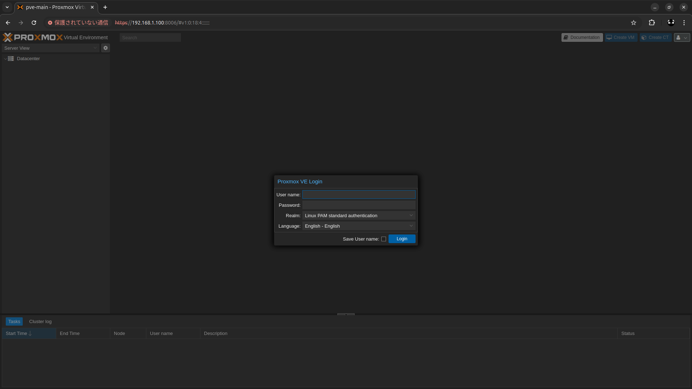
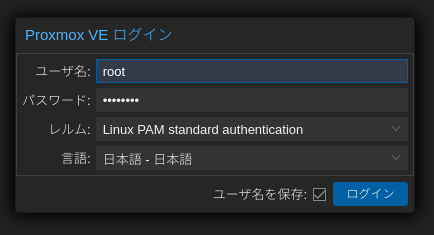
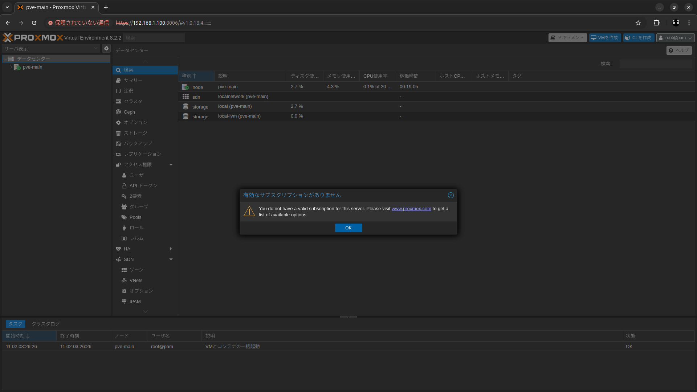

# proxmox-ve_instlal_memo

## 概要
* Proxmox VE をインストールした時のメモ
* Proxmox VE 8.2-2 

## 詳細

### ISO をダウンロード
* https://www.proxmox.com/en/downloads
* Proxmox VE 8.2 ISO インストーラーをダウンロード

### proxmox-ve_8.2-2.iso を適当な USB メモリに焼く
* Ubuntu 24.04 で作業したので dd コマンドで焼いた  
  ※Windows の場合は Rufus などで適当に焼く
* 焼く先の USB 確認 
    ```
    $ sudo fdisk -l
    〜〜〜〜〜〜〜〜〜〜〜〜〜〜〜〜〜〜
    ディスク /dev/sda: 29.44 GiB, 31610372096 バイト, 61739008 セクタ
    Disk model: USB Flash Drive 
    単位: セクタ (1 * 512 = 512 バイト)
    セクタサイズ (論理 / 物理): 512 バイト / 512 バイト
    I/O サイズ (最小 / 推奨): 512 バイト / 512 バイト
    ディスクラベルのタイプ: gpt
    ディスク識別子: 75F08222-06FB-43FE-ADED-9A7D9EAF8502

    デバイス   開始位置 最後から  セクタ サイズ タイプ
    /dev/sda1        64  4162947 4162884     2G Microsoft 基本データ
    /dev/sda2   4162948  4173019   10072   4.9M EFI システム
    /dev/sda3   4173020  4173619     600   300K Microsoft 基本データ
    〜〜〜〜〜〜〜〜〜〜〜〜〜〜〜〜〜〜
    ```
* 焼く
    ```
    $ sudo dd if=./proxmox-ve_8.2-2.iso of=/dev/sda bs=4M status=progress
    333+1 records in
    333+1 records out
    1396899840 bytes (1.4 GB, 1.3 GiB) copied, 0.770178 s, 1.8 GB/s
    ```
    ```
    $ sync
    ```

### Proxmox VE をインストール
* インストール先の端末に焼いた USB 挿して起動
* 全体的に白い Welcome to Proxmox Virtual Environment という画面が表示される
* Install Proxmox VE (Graphical) を選択
* END USER LICENSE AGREEMENT(EULA) が表示されるので右下の I agree をクリック
* Proxmox Virtual Enviroment(PVE) というオレンジのタイトルと、インストール先を選べっぽいことを言われるので選択して Next
* Location and Time Zone selection → 以下を設定して Next
    * Country に japan と入力。Time zone と Keyboard Layout は自動で Asia/Tokyo と Japanese になる
* Administration Password and Email Address → 適当に設定して Next
* Management Network Configuration → 以下は私の環境の設定なので参考に適当に設定して Next
    * Management Interface: enp87s0
        * LAN ポートが 2 つ、Wifi が 1 つの端末にインストールしていたので 3 つ選択肢に表示されていた。つながってるインターフェースの左側に緑の丸が付いてる
    * Hostname(FQDN): pve-main.local
    * IP Address(CIDR): 192.168.1.100/24
    * Gateway: 192.168.1.1
    * DNS Server: 192.168.1.1
    * ※ GUI からは固定 IP しか設定できないので諸般の事情で動的 IP にする場合は、一旦ここは適当にしてインストール後にコンソールで設定する
* Summary が表示されるので確認して問題なければ Install
    * Automatically reboot after successful installation のチェックはそのままの意味っぽいのでお好みで(この時はチェック付けたままにした)
    * わかってたけど USB メモリ抜かないと、再起動後にまた USB ブートしてインストール画面になる　→　電源ボタン押してシャットダウン　→　USB メモリ抜く　→　再度起動
* 正常に起動すると以下のような画面になる。※ IP や pve-main はさっきの設定による
    ```
    -----------------------------------------------------------------------------
    Welcome to the Proxmox Virtual Enviroment. Please use your web browser to 
    configure this server - connect to: 

    https://192.168.1.100:8006/

    -----------------------------------------------------------------------------
    pve-main login: 
    ```

### Proxmox VE にブラウザからログイン
* https://192.168.1.100:8006/ にアクセス　※IP は読み替えて  
    
* 注意: 日本語にしたい場合は先に Language: で日本語を選択
    * 日本語を選択した時点で日本語が適用されるが、その際ユーザー名など入力していたものがクリアされてイラっとする（なんでやねん）
* Proxmox VE にログイン  ※パスワードはインストール時に設定したやつ  
      
      
    ※有効なサブスクリプションがありません と表示されるが無料で使っててそのとおりなので、おまじないだと思って OK を押す